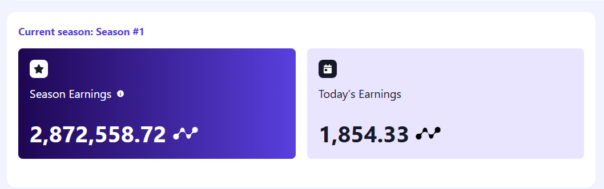

# NODEPAY



A bot for automating Nodepay airdrop interactions, including session management and pinging with proxy support.

---

## Requirements

1. **Node.js** (version 14 or higher)
2. **npm** (Node package manager)

---

## Installation

To get started with the Nodepay Airdrop Bot:

1. Clone the repository:

```bash
git clone https://github.com/Rambeboy/nodepay-network-bot.git && cd nodepay-network-bot
```

3. Install the dependencies:

```bash
npm install
```

---

## Configuration

Before running the bot, you need to create two text files:

### 1. `token.txt`

To get your Bearer token:

1. **Register for a Nodepay account**:
- Go to [Nodepay Registration Page](https://app.nodepay.ai/register?ref=3WZFKKi0Hbvi1sd) and sign up for an account.

2. **Get your token**:

- Open **DevTools** in your browser (right-click > Inspect or press `Ctrl+Shift+I`).

- Go to the **Console** tab in DevTools.

- Type the following command to get your token:
  ```bash
  javascript localStorage.getItem('np_webapp_token') 
  ```

- This will return the Bearer token. **Copy the token** (without the `Bearer` prefix, just the alphanumeric string).

3. **Paste the token in `token.txt`**:
- Create a `token.txt` file in the root of your project and paste your token in the file (one token per line).

- Example `token.txt`:

```text
ey...
ey...
ey...
```

### 2. `proxy.txt`

- Add your proxy details in `proxy.txt`. Each line should have the format:

```text
host:port:username:password
```

- Example:

```text
123.45.67.89:8080:username:password
123.45.67.89:8080:username:password
123.45.67.89:8080:username:password
```

---

## Running the Bot

To start the bot, run the following command:

```bash
npm start
```

The bot will begin the process of connecting to the session, sending pings, and logging relevant information.

---

## Logs

The bot will log the status and activity, including:

- Connection status for each session (UID).
- Ping status for each session.
- IP address used for each proxy.

Logs are stored in `bot.log` and can also be seen in the console.


---

## License

This project is licensed under the MIT License - see the [LICENSE](LICENSE) file for details.
